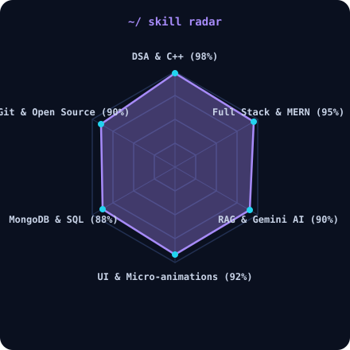
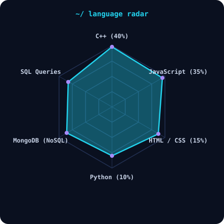

<div align="center">


<br><br>

<!-- NAME / TAGLINE - animated typing -->
<a href="https://github.com/Sanyaaroraaa">

</a>
<br>

<!-- SOCIALS -->
<a href="https://sanyaarora7.vercel.app/"></a>
<a href="https://sanyaarora7.vercel.app/resume.pdf?v=1.2"></a>
<a href="https://cal.com/sanya-arora/30min"></a>
<a href="mailto:asanya765@gmail.com"></a>
<a href="https://leetcode.com/u/Sanyaaroraaa"></a>
</div>

---

## `~/` whoami

```console
$ cat about.txt
```

Hi, I'm **Sanya Arora** (she/her). I build polished full-stack web apps that sit right between clean UI and solid engineering, and I solve problems for fun when neither of those is cooperating.

- Currently building **[StudyLoop](https://github.com/insharahn/studyloop)** & **[NovaAI](https://github.com/Sanyaaroraaa/NOVA-AI)**
- Portfolio: **[sanyaarora7.vercel.app](https://sanyaarora7.vercel.app)**
- Learning **RAG Pipelines & Gemini 2.5 Flash**
- Consistent in **DSA (600+ problems solved, Peak LeetCode Rating: 1803)**
- **Fun facts:**
  - 🎨 **Occasionally spends 45 minutes obsessing over CSS padding & micro-animations to make the UI picture-perfect, despite 600+ DSA problems solved.**
  - 🚀 **Cannot stop adding "just one more feature" right when an app is ready to ship.**
  - 📓 **Built a spiral-notebook task planner because standard to-do apps look too much like Excel spreadsheets.**
  - ☕ **Always down to debate whether Tailwind counts as "real CSS" over a cup of coffee.**

<br>

<div align="center">

## `~/` toolbox


</div>

---

<div align="center">

## `~/` skill radar

<table>
<tr>
<td width="50%" align="center" valign="middle">
<picture>
<source media="(prefers-color-scheme: dark)" srcset="assets/radar-dark.svg">
<source media="(prefers-color-scheme: light)" srcset="assets/radar-light.svg">

</picture>
</td>
<td width="50%" align="center" valign="middle">
<picture>
<source media="(prefers-color-scheme: dark)" srcset="assets/radar-langs-dark.svg">
<source media="(prefers-color-scheme: light)" srcset="assets/radar-langs-light.svg">

</picture>
</td>
</tr>
</table>

</div>

---

<div align="center">

## `~/` contribution calendar

<!-- Snake eats the contribution graph -->
<picture>
<source media="(prefers-color-scheme: dark)" srcset="https://raw.githubusercontent.com/Sanyaaroraaa/Sanyaaroraaa/output/github-contribution-grid-snake.svg">
<source media="(prefers-color-scheme: light)" srcset="https://raw.githubusercontent.com/Sanyaaroraaa/Sanyaaroraaa/output/github-contribution-grid-snake.svg">

</picture>

</div>

---

<div align="center">

## `~/` the numbers


<br><br>


</div>

---

<div align="center">

## `~/` selected work

<a href="https://github.com/insharahn/studyloop">
  
</a>
<a href="https://github.com/Sanyaaroraaa/NOVA-AI">
  
</a>
<br/><br/>
<a href="https://github.com/Sanyaaroraaa/Interactive-Calendarr">
  
</a>

</div>

---

<div align="center">

## `~/` achievements

- **v23.0** — **600+ DSA problems solved** (LeetCode, HackerRank, CodeChef, GFG)
- **v22.2** — peak LeetCode contest rating: **1803**
- **v21.5** — **StudyLoop**: Ranked **#26 globally on Product Hunt** & **Top 50 / Category Winner @ DoraHacks 2.0**
- **v21.0** — **SWOC 2026**: ranked **16th globally** for open-source contributions
- **v20.2** — **Top 15, Best Pitch** @ Sheryians Coding School hackathon
- **v19.0** — HackerRank Problem Solving: **5⭐**
- **v18.5** — CodeChef: **2⭐**

</div>

---

<div align="center">

## GitHub Trophies


</div>

---

<div align="center">

## Random Dev Quote


</div>
